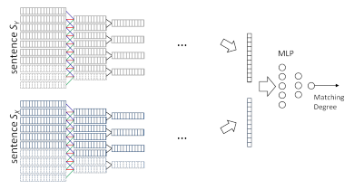

## CNN For Matching Natural Language Sentences
 摘要：相似性评估是机器学习领域常见的任务，大多数监督或者非监督任务的分类和回归都绕不开它．句子匹配是自然语言处理中比较常见的相似性计算任务，类似于图像，自然语言中也常常利用深度网络强大的非线性特征提取能力将原始输入映射到抽象的特征向量，从而方便距离的比较及建立其它相关任务．虽然词嵌入方法比较好的建立起字典到向量空间的映射，但是词与词之间可能存在短语模式当时并没有完全自然的联系方法，因此该论文的作者提出了利用卷积神经网络中的滤波器模板的方法去联系词向量与词向量，并且巧妙地利用最大池化的方式给予网络自动学习过滤概率较低的词组的能力，在相关句子匹配任务中取得很好的效果．    
   
那么下面稍微具体一点地讲讲自己对一些细节的理解吧．首先在已经训练好词嵌入模型的基础上，将句子每个单词对应的词嵌入向量按顺序排列成一个矩阵．然后用多个卷积模板在相邻几个词对应的词向量之间做卷积，得到多个词响量的概率组合，其作用也包含词向量的调整．接近着跟上最大池化可以将上一步得到的概率小或者作用不明显的词组忽略掉．重复几次上述操作过后可以进一步得到匹配较远词组的能力．另外值得一提的是为了避免句子长度不一样造成的０单词向量，文章还提出在卷积过程中使用一个门函数使输入全为零的时候输出也为零，也就是说，不希望其中单词数量更少的句子在边界处纠结从不存在单词处学习匹配存在单词的长句子.   
  
具体应用到句子匹配的任务，文章基于上面的卷积网络提出了两种结构．其一，利用一个基于卷积的siamese网络的非线性特征提取能力，分别从两个句子提取词组匹配特征，然后利用多类感知机综合两部分特征．其劣势是每次前向传播需要分别进行一次匹配特征提取，也就是连个句子之间没有互动．其二，先将两个句子的词嵌入矩阵按两个方向排列起来，根据卷积核将对应两个句子的同位置的词向量并排起来卷积．然后进行二维池化，这里一个维位池化就等价于从４个错位词组选择最优词组．随后重复地进行前面的步骤，这个模型的优势是句子之间错位词组还可以融合到卷积结构中．  
 
